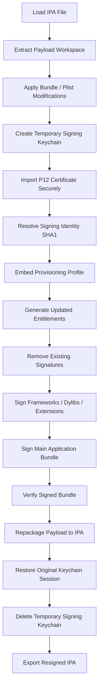

# IPASignCraft

A lightweight macOS utility to re-sign IPA files with clarity, safety, and control.

---

## 🖼️ Preview

### Home Screen


### IPA Selection


### Certificate & Provisioning


### Result


---

## ✨ Features

* Simple IPA loading
* Certificate (.p12) support
* Provisioning profile integration
* Secure temporary keychain signing
* Clean re-signing workflow
* Export ready-to-install IPA

---

## ⚙️ Secure Re-Signing Workflow



---

## ⬇️ Download

👉 **[Download Latest Version](https://github.com/CodeWorldBlog/ipasigncraft/releases/latest)**

---

## ⚡ Quick Start

1. Open IPASignCraft
2. Load your IPA
3. Select certificate and provisioning profile
4. Apply desired signing options
5. Click **Re-sign**
6. Export the newly signed IPA

---

## 🧰 Requirements

* macOS 12+
* Apple Developer Certificate (.p12)
* Provisioning Profile (.mobileprovision)

---

## 🔒 Security Approach

IPASignCraft uses an isolated temporary signing keychain during the re-sign process.

This means:

* No permanent certificate import into Login Keychain
* No System Keychain modification
* No persistent signing identity left on macOS
* Temporary signing artifacts are removed automatically after completion

Designed to keep the host machine clean while maintaining a stable Apple signing workflow.

---

## 📁 Project Structure

```text
IPASignCraft/
 ├── App/
 ├── Core/
 ├── Features/
 ├── Resources/
 └── docs/
```

---

## 📜 License

MIT License

---

## 🤝 Contributing

Open to improvements, ideas, and refinements.

---

## 🔍 Notes

* Designed for development and internal testing workflows
* Follows Apple code-signing mechanisms
* Does not bypass Apple platform security restrictions