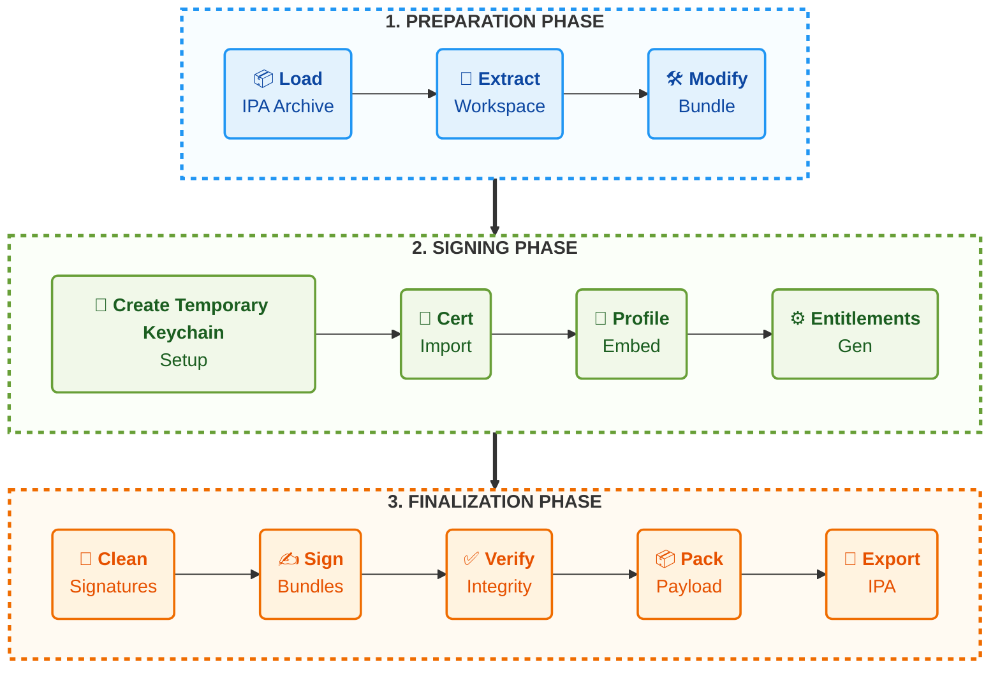

<p align="center">
  
</p>

<h1 align="center">IPASignCraft</h1>

<p align="center">
A lightweight macOS utility to re-sign IPA files with clarity, safety, and control.
</p>

<p align="center">
  <a href="https://github.com/CodeWorldBlog/ipasigncraft/releases/latest"><b>⬇ Download Latest Release</b></a>
</p>

---

## 🖼️ Application Preview

<p align="center">
  
</p>

<p align="center"><i>Main workspace of IPASignCraft</i></p>

---

## ✨ Core Features

- Clean drag-and-drop IPA loading
- Apple certificate (.p12) signing support
- Provisioning profile embedding
- Temporary isolated keychain signing
- Bundle identifier and metadata modification
- Secure export of ready-to-install IPA
- Real-time signing progress logs

---

## 🧩 Detailed Screens

### IPA Selection Workflow

<p align="center">
  
</p>

---

### Certificate & Provisioning Setup

<p align="center">
  
</p>

---

### Final Signing Result

<p align="center">
  
</p>

---

## ⚙️ Signing Pipeline



---

## ⚡ Quick Start

1. Launch IPASignCraft
2. Load target IPA file
3. Select provisioning profile
4. Choose signing certificate (.p12 or keychain)
5. Configure optional bundle modifications
6. Start secure re-sign process
7. Export signed IPA

---

## 🧰 Requirements

- macOS 12.0+
- Apple Developer Certificate (.p12) or local keychain certificate
- Valid Provisioning Profile (.mobileprovision)

---

## 🔒 Security Philosophy

IPASignCraft performs the signing process inside an isolated temporary macOS keychain session.

This ensures:

- No permanent certificate import into Login Keychain
- No modification of System Keychain
- No long-lived signing identity left on the machine
- Temporary signing artifacts are removed automatically after completion

A cleaner and safer workflow for Apple code-signing operations.

---

## 📁 Project Structure

```text
IPASignCraft/
 ├── App/
 ├── Core/
 ├── Features/
 ├── Resources/
 └── docs/
```

---

## ⬇️ Download

**[Download Latest Version](https://github.com/CodeWorldBlog/ipasigncraft/releases/latest)**

---

## 📜 License

MIT License

---

## 🤝 Contributing

Ideas, refinements, and pull requests are welcome.

---

## 🔍 Notes

- Built for development and internal testing workflows
- Uses Apple's standard code-signing mechanisms
- Does not bypass Apple platform security enforcement