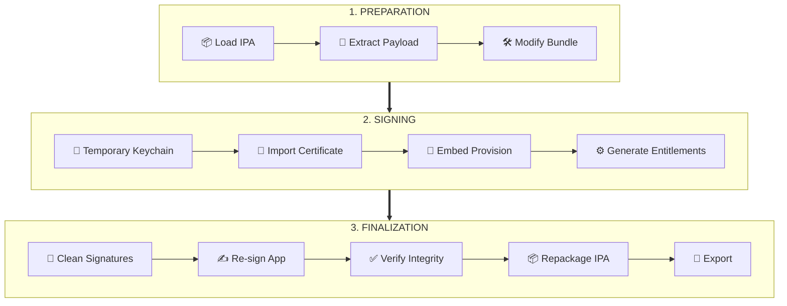

<p align="center">
  
</p>

<h1 align="center">IPASignCraft</h1>

<p align="center">
A lightweight macOS utility to manage and re-sign development IPA packages with clarity, safety, and control.
</p>

<p align="center">
  <a href="https://techstories.blog"><b>Tech Stories Blog</b></a> •
  <a href="https://github.com/CodeWorldBlog/ipasigncraft/releases/latest"><b>⬇ Download Latest Release</b></a>
</p>

---

## 🖼 Application Preview

<p align="center">
  
</p>

<p align="center">
  <i>Main workspace of IPASignCraft</i>
</p>

---

## ✨ Core Features

- Clean drag-and-drop IPA loading
- Apple certificate (.p12) signing support
- Provisioning profile embedding
- Temporary isolated keychain signing
- Bundle identifier and metadata modification
- Secure export of ready-to-install IPA
- Real-time signing progress logs

---

## 🧩 Detailed Screens

### IPA Selection Workflow

<p align="center">
  
</p>

---

### Certificate & Provisioning Setup

<p align="center">
  
</p>

---

### Final Signing Result

<p align="center">
  
</p>

---

## ⚙️ Signing Pipeline



---

## ⚡ Quick Start

1. Launch IPASignCraft
2. Load target IPA file
3. Select provisioning profile
4. Choose signing certificate (.p12 or keychain)
5. Configure optional bundle modifications
6. Start signing process
7. Export signed IPA

---

## 🛡 macOS Security Notice

Because IPASignCraft is currently distributed as an open-source unsigned build, macOS may display a security warning during first launch.

To open:

1. Right-click the app
2. Select "Open"
3. Confirm the dialog

You may also need:

```text
System Settings → Privacy & Security → Open Anyway
```

---

## 💻 Supported Platforms

- macOS Apple Silicon
- macOS Intel

---

## 🧰 Requirements

- macOS 12.0+
- Xcode Command Line Tools
- Apple Developer Certificate (.p12) or local keychain certificate
- Valid Provisioning Profile (.mobileprovision)

---

## 🏗 Build From Source

```bash
git clone https://github.com/CodeWorldBlog/ipasigncraft.git
cd ipasigncraft
open IPASignCraft.xcodeproj
```

Build using Xcode 16+.

---

## 🧱 Built With

- Swift
- SwiftUI
- Security.framework
- Apple's standard codesign tooling

---

## 🔒 Security Philosophy

IPASignCraft performs the signing process inside an isolated temporary macOS keychain session.

This ensures:

- No permanent certificate import into Login Keychain
- No modification of System Keychain
- No long-lived signing identity left on the machine
- Temporary signing artifacts are removed automatically after completion

A cleaner and safer workflow for Apple code-signing operations.

---

## 🔐 Certificate Handling

IPASignCraft never ships with certificates or provisioning profiles.

Users must provide their own Apple development assets locally during the signing process.

---

## 📁 Project Structure

```text
IPASignCraft/
 ├── App/
 ├── Core/
 ├── Features/
 ├── Resources/
 └── docs/
```

---

## ⬇️ Download

**[Download Latest Version](https://github.com/CodeWorldBlog/ipasigncraft/releases/latest)**

---

## 🤝 Contributing

Ideas, refinements, and pull requests are welcome.

Please open an issue before major architectural or workflow changes.

---

## 📜 License

MIT License

---

## 🔍 Notes

- Built for development and internal testing workflows
- Uses Apple's standard code-signing mechanisms
- Does not bypass Apple platform security enforcement
- Designed for transparency and local control